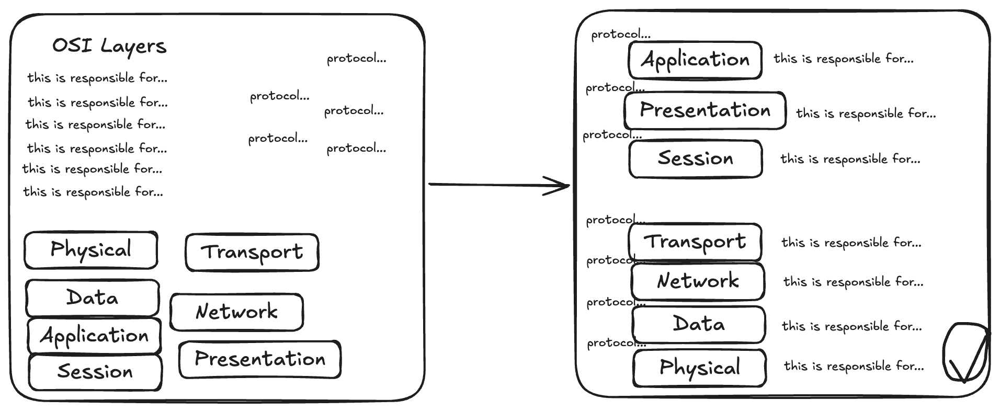

# PLAN

## What this app is
This app is intended to be a place I can go to exercise the visual recollection part of my brain. 
Adaptable and receptive to input
Move boxes and fill text
Option to reveal or research further
The FEYNAM rules

## Topics to start
-- start with the network layers
-- text to fill in the 7 layers
-- tcp ip
-- CISSP - the ISO standards
-- K8S - cluster and services

https://www.linkedin.com/pulse/what-i-learnt-today-illusion-explanatory-depth-young-ca-sa--ioawf

https://pmc.ncbi.nlm.nih.gov/articles/PMC3062901/

https://thedecisionlab.com/biases/the-illusion-of-explanatory-depth

https://www.linkedin.com/pulse/illusion-explanatory-depth-arvind-saraswat-5t1sc/

https://www.linkedin.com/posts/keith-andes_the-illusion-of-explanatory-depth-says-activity-7389099913567109120-6Gqm/

## Here and now

Get started with a svelte app on github. The app should be on github and it should be something I can build on.

## Focus on the future

Is there a place for LLMs here - can I gather info or extract diagram chunks automatically and use the reconstruction to learn? Dunno. 

## Horizon

A regular use app that helps me keep sharp, a rewarding experience, something others find value in, part of a community of tools

